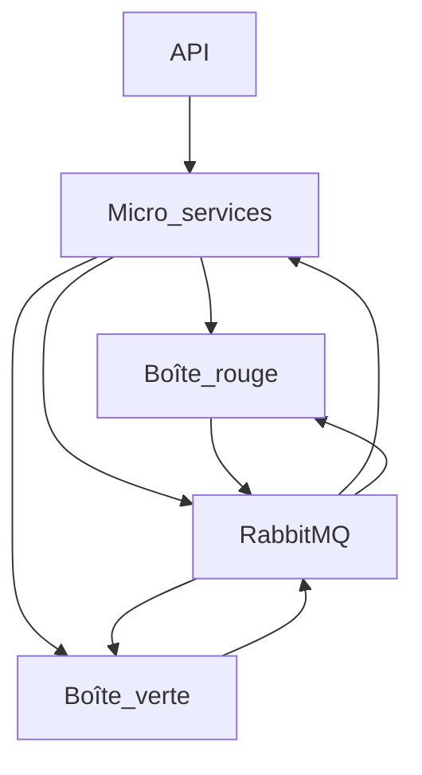

# TP 1 - Identifier l'infrastructure

Chez OneStock, nous avons de nombreux développeurs qui travaillent à l'implémentation de nouvelles fonctionnalitées sur les différentes applications (backoffice et vendor interface), d'autres qui travaillent à l'intégration des clients à notre technologie.

Il existe également une équipe spéciale, appelée *Force Rouge* qui travaille exclusivement sur des problématiques DevOps. Leur rôle chez OneStock est de maintenir l'infrastructure de production mais également celles de qualif et de test. Certains des membres de l'équipe s'occupent également du parc informatique (mises à jours, logiciels, etc.) du réseau et de l'active directory.

Pour réaliser nos développements, nous utilisons des Skaffold privés contenant une instance complète de la solution OneStock.

**Schéma de l'infrastructure OneStock:**



**Processus de développement:**

```mermaid
gitGraph
    branch qualif
    branch tests
    branch dev
    branch v1
    branch feature/new_footer
    commit
    commit
    commit
    commit tag:"pull request"
    merge v1
    branch feature/new_login_form
    commit
    commit
    commit
    commit tag:"pull request"
    merge v1
    commit tag:"release v1"
    merge tests
    commit "hotfix/new_form_event_error"
    merge qualif
