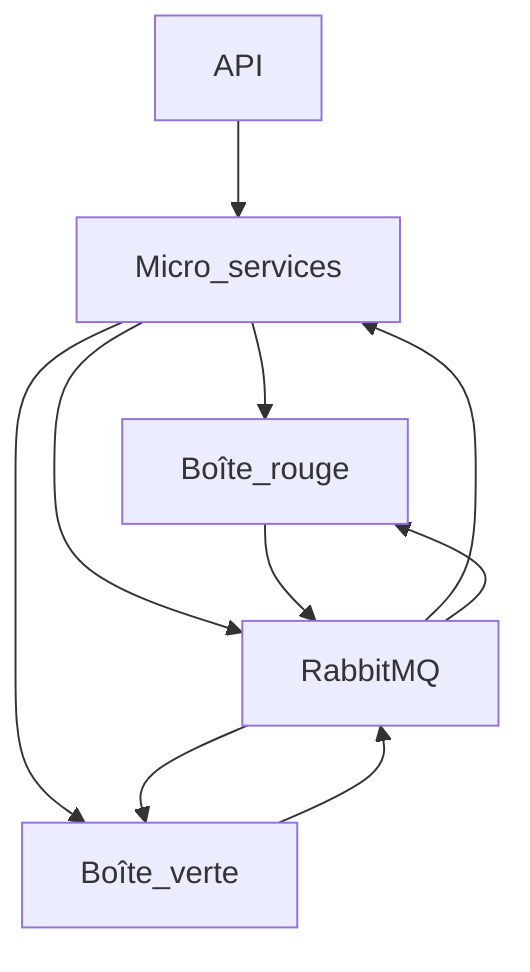
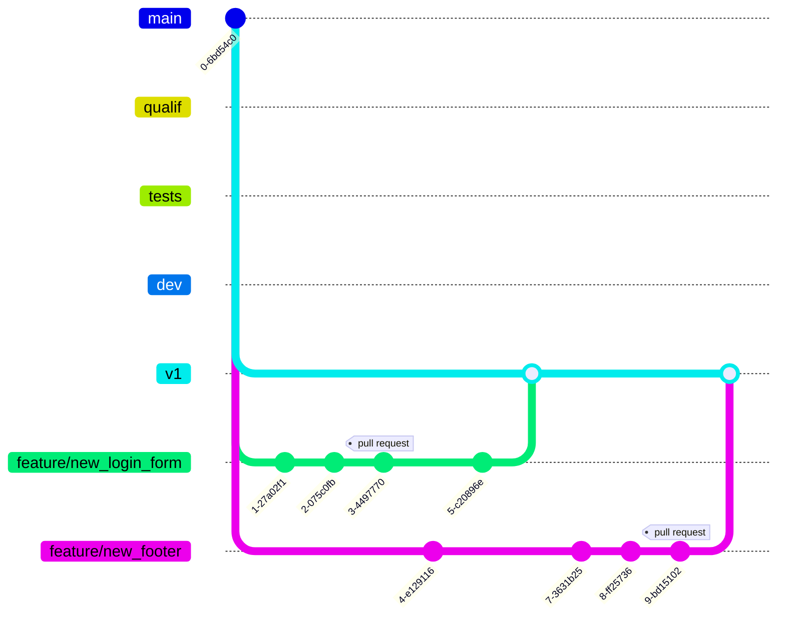

# TP Docker 1

## Partie 1

### Récupérer l'image depuis le HUB

```bash
docker search nginx
docker pull nginx
```

### Vérifier le téléchargement de notre image

```bash
docker images
```

|REPOSITORY|TAG     |IMAGE ID    |CREATED    |SIZE |
|----------|--------|------------|-----------|-----|
|nginx     |`latest`|ac8efec875ce|5 hours ago|142MB|

### Servir la nouvelle page

```bash
docker run --name myNginx -v C:\Users\palim\.ynov\devops\tp_docker_1\html:/usr/share/nginx/html -p 80:80 -d nginx
```

`ccbb8eb9978bfe76a98410caf95d8f57ef72375adb884db1bb8357d9d6f1a9a1`

### Supprimer le container

```bash
docker container stop cc
docker container rm cc
```

### Copier les fichiers avec `cp`

```bash
docker volume create nginx-html
docker run --name myNginx -v nginx-html:/usr/share/nginx/html -p 80:80 -d nginx
docker cp .\html\index.html myNginx:/usr/share/nginx/html
```

## Partie 2

### Créer une image avec Dockerfile

```bash
docker build -t tp_nginx_1 .
docker images
```

|REPOSITORY|TAG     |IMAGE ID    |CREATED       |SIZE |
|----------|:------:|------------|--------------|-----|
|tp_nginx_1|`latest`|e7a4bac2326a|14 seconds ago|142MB|
|nginx     |`latest`|ac8efec875ce|6 hours ago   |142MB|

### Lancer cette nouvelle image

```bash
docker run --name myNginx -p 80:80 -d tp_nginx_1
```

### Conclusions

L'utilisation d'une image personnalisée, créée par un `Dockerfile` permet d'allèger la commande de lancement du conteneur.

Pour le développement, l'utilisation de volumes simplifie les processus car les images sont immuables. On perd ainsi en flexibilité.

Cependant, pour partager notre projet ou lancer l'application dans un environnement de production, utiliser des images est le plus indiqué.

Chez OneStock, nous avons de nombreux développeurs qui travaillent à l'implémentation de nouvelles fonctionnalitées sur les différentes applications (backoffice et vendor interface), d'autres qui travaillent à l'intégration des clients à notre technologie.

Il existe également une équipe spéciale, appelée *Force Rouge* qui travaille exclusivement sur des problématiques DevOps. Leur rôle chez OneStock est de maintenir l'infrastructure de production mais également celles de qualif et de test. Certains des membres de l'équipe s'occupent également du parc informatique (mises à jours, logiciels, etc.) du réseau et de l'active directory.

Pour réaliser nos développements, nous utilisons des Skaffold privés contenant une instance complète de la solution OneStock.

**Schéma de l'infrastructure OneStock:**



**Processus de développement:**


